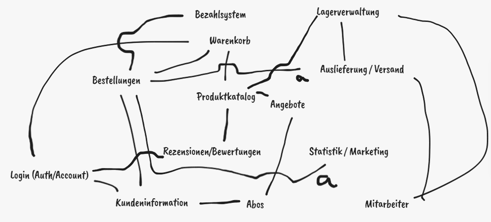

# Account Service Sample

[Folien](REST.pdf)

Wir haben diese Microservices-Architektur konzipiert:

Darauf basierend haben wir unsere REST-API für den _AccountService_ designt:
 - [Formlos](docs/accountservice.md)
 - [OpenAPI](openapi.yml)
 
## Zusätzliche Themen:
 - Problem Details: [RFC-9457](https://datatracker.ietf.org/doc/html/rfc9457) (ehem. RFC-7807)
 - [Hypermedia APIs](https://www.innoq.com/en/articles/2020/12/rest-apis-with-hal/)
 

## SOAP vs. REST vs. GraphQL

Kriterium| SOAP | REST | GraphQL
-------- |-------- | -------- | --------
HTTP     | nur Überträger (nur POST, nur 1 URL) | möglichst vollständig | nur Überträger (nur POST, nur 1 URL)
Austauschformat | XML (SOAP XSD, W3C-Standards) | JSON o.a. (Content Negotiation) | JSON (Query Syntax in Request Body)
Vorteil | Nutzen der W3C-XML-*-Standards | Kompatibilität mit HTTP-Netzwerk-Komponenten (Proxies, Firewalls,...), einfaches Ansprechen vom Frontend | Dynamische Datenstrukturen bei der Abfrage (Lazy Loading in der Implementierung), JSON erlaubt Aufrufe vom Frontend wie REST